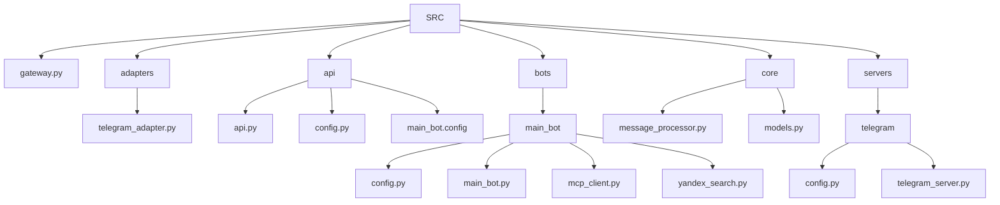
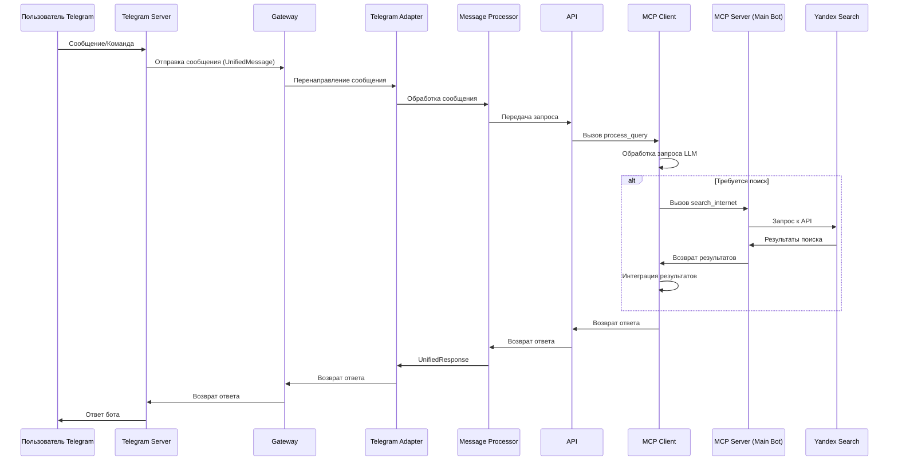

# Telegram бот с локальной LLM и поиском в интернете

В данном проекте реализован Telegram-бот, работающий на локальной языковой модели (LLM), `llama3.1:8b-instruct-q4_K_M`, с возможностью поиска в интернете через модуль `yandex_search`, использующий Yandex Search API.

Бот представляет собой интеллектуального помощника, способного отвечать на запросы пользователей с использованием актуальной информации из интернета.

## Содержание

- [Особенности](#особенности)
- [Структура проекта](#структура-проекта)
  - [Описание директорий и файлов](#описание-директорий-и-файлов)
- [Взаимодействие модулей и поток данных](#взаимодействие-модулей-и-поток-данных)
  - [Обзор потока данных](#обзор-потока-данных)
- [Клиент и сервер Model Context Protocol (MCP)](#клиент-и-сервер-model-context-protocol-mcp)
  - [MCP Server (`main_bot.py`)](#mcp-server-main_botpy)
  - [MCP Client (`mcp_client.py`)](#mcp-client-mcp_clientpy)
- [Руководство по настройке](#руководство-по-настройке)
  - [1. Предварительные требования](#1-предварительные-требования)
  - [2. Настройка проекта](#2-настройка-проекта)
  - [3. Настройка туннеля с помощью Tuna.am (или аналогичного сервиса)](#3-настройка-туннеля-с-помощью-tunaam-или-аналогичного-сервиса)
  - [4. Запуск компонентов бота](#4-запуск-компонентов-бота)
- [Примеры взаимодействия с ботом](#примеры-взаимодействия-с-ботом)


## Особенности

*   **Интеграция локальной LLM**: Использует локально размещенную модель `llama3.1:8b-instruct-q4_K_M` для понимания и генерации естественного языка, обеспечивая конфиденциальность и снижая зависимость от внешних API.
*   **Возможность поиска в интернете**: Интегрирован с модулем `yandex_search` для получения актуальной информации, что позволяет боту отвечать на вопросы, требующие свежих данных (новости, события и т.д.).
*   **Мультипротокольный шлюз**: Компонент `gateway.py` служит единой точкой входа для различных типов клиентов (в настоящее время поддерживается только Telegram) и маршрутизирует сообщения соответствующим обработчикам.
*   **Модульная архитектура**: Проект структурирован на отдельные модули (адаптеры, API, логика бота, ядро, серверы) для удобства поддержки и масштабирования.
*   **Конфигурируемость**: Простая настройка параметров LLM, API-ключей и прокси через файлы `main_bot.config` и `.env`.
*   **Интеллектуальная обработка запросов**: Бот использует интернет-поиск для свежих данных, формулирует лаконичные запросы, анализирует несколько источников и суммирует информацию, возвращая структурированный ответ.
*   **Комплексная система логирования**: Подробное логирование реализовано во всех компонентах для облегчения отладки и мониторинга.

## Структура проекта

Проект реализован по модульной архитектуре, где функциональные блоки логически сгруппированы в соответствующие директории. Ниже представлена визуализация структуры каталогов проекта и описание его ключевых компонентов.



### Описание директорий и файлов

*   `gateway.py`: Центральная точка входа для мультипротокольного шлюза. Принимает входящие сообщения от различных типов клиентов (например, Telegram) и направляет их соответствующим адаптерам для обработки. Также обрабатывает аутентификацию по API-ключу и предоставляет эндпоинты для проверки состояния и статистики.

*   `adapters/`: Содержит модули, отвечающие за преобразование входящих сообщений с разных платформ в унифицированный формат и отправку ответов обратно на эти платформы.
    *   `telegram_adapter.py`: Специально обрабатывает коммуникацию с Telegram Bot API. Преобразует обновления Telegram в объекты `UnifiedMessage` и обрабатывает объекты `UnifiedResponse` для отправки обратно в Telegram.

*   `api/`: Содержит основную логику API для взаимодействия с главным ботом и управления его конфигурацией.
    *   `api.py`: Предоставляет интерфейс для взаимодействия других компонентов с `main_bot`. Инициализирует `MCPClient` и обрабатывает запросы к главному боту.
    *   `config.py`: Файл конфигурации для модуля API. Включает настройки прокси и путь к конфигурации главного бота.
    *   `main_bot.config`: JSON-файл конфигурации для сервера `main_bot`, определяющий его имя, исполняемый файл, аргументы, переменные окружения и параметры LLM (URL API, модель, температуру и т.д.). Также содержит основные инструкции для бота.

*   `bots/`: Содержит реализацию различных ботов.
    *   `main_bot/`: Директория для основной логики бота.
        *   `config.py`: Конфигурация, специфичная для `main_bot`, такая как ключи API Yandex Search и настройки прокси.
        *   `main_bot.py`: Главный скрипт бота, который инициализирует сервер `FastMCP` и определяет инструмент `search_internet`, который может использовать LLM. Также обрабатывает логирование и разбор аргументов.
        *   `mcp_client.py`: Клиентская реализация для протокола [Model Context Protocol (MCP)](https://modelcontextprotocol.io/introduction), используемая `api.py` для связи с сервером `main_bot`.
        *   `yandex_search.py`: *Примечание: Этот модуль разработан отдельно и используется как зависимость. Его основная функция - взаимодействие с Yandex Search API, форматирование и оптимизация результатов поиска.*

*   `core/`: Содержит фундаментальные модели и логику обработки сообщений, общие для всего приложения.
    *   `message_processor.py`: Центральный компонент, отвечающий за управление обработкой объектов `UnifiedMessage`. Взаимодействует с `API` для получения ответов от главного бота и управляет статистикой сообщений.
    *   `models.py`: Определяет модели данных (например, `UnifiedMessage`, `UnifiedResponse`, `ClientType`, `MessageType`, `AdapterStatus`), используемые для последовательного обмена данными между различными частями системы.

*   `servers/`: Содержит реализации для различных типов серверов.
    *   `telegram/`:
        *   `config.py`: Конфигурация для Telegram-сервера, включая токен бота, домен вебхука, внутренний API ключ и URL шлюза.
        *   `telegram_server.py`: Приложение FastAPI, которое выступает в качестве конечной точки вебхука для Telegram. Получает обновления от Telegram, преобразует их в унифицированный формат и отправляет в `Gateway` для дальнейшей обработки. Также настраивает команды Telegram и управляет жизненным циклом вебхука.

## Взаимодействие модулей и поток данных

Архитектура проекта разработана для обеспечения четкого и эффективного потока информации от ввода пользователя в Telegram до LLM и обратно. `Gateway` выступает в качестве центрального узла, унифицируя коммуникацию от различных типов клиентов перед маршрутизацией к основной логике обработки. `Model Context Protocol (MCP)` имеет решающее значение для взаимодействия между `API` и `main_bot`.

### Обзор потока данных



1.  **Ввод пользователя Telegram**: Пользователь отправляет сообщение или команду Telegram-боту.
2.  **Telegram Server (`telegram_server.py`)**: Telegram Bot API отправляет обновление в `telegram_server.py` через вебхук. `telegram_server` проверяет запрос, преобразует объект Telegram `Update` в стандартизированный `payload` (словарь, содержащий `id`, `timestamp`, `client_type`, `message_type`, `content`, `user_id`, `user_name` и `metadata`), а затем отправляет этот `payload` на эндпоинт `/message` `Gateway`.
3.  **Мультипротокольный шлюз (`gateway.py`)**: `Gateway` получает `payload`. Он аутентифицирует запрос с помощью заголовка `X-API-Key`. На основе `client_type` в `payload` (например, `telegram`) он направляет сообщение соответствующему адаптеру через метод `handle_unified_message` (к примеру, `telegram_adapter.handle_unified_message`).
4.  **Telegram Adapter (`telegram_adapter.py`)**: `telegram_adapter` получает `UnifiedMessage` от `Gateway`. Его основная роль - подготовить сообщение для основной логики обработки. Затем он передает этот `UnifiedMessage` в `MessageProcessor`.
5.  **Message Processor (`message_processor.py`)**: Этот компонент отвечает за высокоуровневое управление обработкой сообщений. Он принимает `UnifiedMessage` и вызывает метод `API.process_query()`, фактически передавая сообщение логике главного бота.
6.  **API (`api.py`)**: Модуль `api.py` выступает в качестве посредника между `MessageProcessor` и `main_bot`. Он инициализирует `MCPClient` с использованием конфигурации LLM, загруженной из `main_bot.config`. Когда вызывается `API.process_query()`, он использует `MCPClient` для обработки запроса пользователя.
7.  **Взаимодействие MCP Client (`mcp_client.py`) и MCP Server (`main_bot.py`)**: MCP Client обрабатывает запрос с помощью своей локальной LLM (`llama3.1:8b-instruct-q4_K_M`). Если LLM определяет необходимость поиска, клиент вызывает инструмент `search_internet` на MCP Server. MCP Server выполняет инструмент и возвращает результаты поиска клиенту. Клиент интегрирует результаты в контекст и завершает обработку запроса.
8.  **Yandex Search (`yandex_search.py`)**: Когда вызывается инструмент `search_internet`, выполняется модуль `yandex_search.py`. Этот модуль делает запросы к Yandex Search API, получает результаты, оптимизирует их и форматирует в удобочитаемую строку, которая затем возвращается в LLM.
9.  **Обработка LLM и генерация ответа**: LLM в MCP Client получает результаты поиска (если есть) и включает их в процесс генерации ответа. Затем она формулирует окончательный ответ на основе своих внутренних знаний и полученной поисковой информации.
10. **Ответ обратно в API**: MCP Client отправляет сгенерированный ответ обратно в `api.py`.
11. **Ответ обратно в Message Processor**: `api.py` возвращает ответ в `MessageProcessor`.
12. **Ответ обратно в Telegram Adapter**: `MessageProcessor` возвращает `UnifiedResponse` в `telegram_adapter`.
13. **Ответ обратно в Gateway**: `telegram_adapter` возвращает `UnifiedResponse` в `Gateway`.
14. **Ответ обратно в Telegram Server**: `Gateway` отправляет `UnifiedResponse` обратно в `telegram_server`.
15. **Вывод для пользователя Telegram**: `telegram_server` затем использует Telegram Bot API для отправки ответа бота обратно пользователю в Telegram-чат.

Этот детализированный поток гарантирует, что сообщения последовательно обрабатываются соответствующими компонентами, и ответы доставляются пользователю своевременно.

## Клиент и сервер Model Context Protocol (MCP)

Model Context Protocol (MCP) - это стандартизированный протокол коммуникации, используемый в этом проекте для обеспечения бесшовного взаимодействия между различными компонентами, особенно между модулем `api.py` и сервером `main_bot.py`. Он облегчает выполнение задач на основе LLM и вызовов инструментов.

### MCP Server (`main_bot.py`)

Скрипт `main_bot.py` выступает в качестве MCP-сервера, используя фреймворк `FastMCP`. Его основные обязанности включают:
*   **Предоставление инструментов**: Он определяет и предоставляет вызываемые функции как «инструменты», которые может использовать LLM. В этом проекте ключевым инструментом является `search_internet`, который позволяет выполнять веб-поиск через модуль `yandex_search`.

*   **Выполнение инструментов**: Когда инструмент вызывается MCP-клиентом, сервер выполняет соответствующую функцию (например, `search_internet`) и возвращает результат.
*   **Возврат результатов**: После выполнения инструмента MCP-сервер отправляет результат обратно клиенту.
*   **Коммуникация через стандартный ввод/вывод**: Сервер `FastMCP` настроен на работу с использованием стандартного ввода/вывода (`run_stdio_async`), что означает, что он обменивается данными со своими клиентами, читая из `stdin` и записывая в `stdout`.

### MCP Client (`mcp_client.py`)

Модуль `mcp_client.py` предоставляет клиентскую реализацию для взаимодействия с MCP-сервером. В этом проекте он создается и используется внутри `api.py`. Его основные функции:

*   **Подключение к серверу**: `MCPClient` устанавливает соединение с сервером `main_bot`. Это соединение обычно управляется методом `connect_to_server`, который обрабатывает базовый механизм коммуникации (в данном случае стандартный ввод/вывод).
*   **Обработка запросов с помощью LLM**: Он обрабатывает пользовательские запросы с помощью локальной LLM `llama3.1:8b-instruct-q4_K_M`.
*   **Вызов инструментов**: Если LLM определяет необходимость использования инструмента, клиент отправляет соответствующий запрос на подключенный MCP-сервер.
*   **Интеграция результатов**: Он получает результаты от MCP-сервера и интегрирует их в контекст для продолжения обработки LLM.
*   **Очистка**: Клиент отвечает за корректное закрытие соединений и освобождение ресурсов после завершения взаимодействия с сервером.

По сути, клиент и сервер MCP работают вместе, чтобы создать надежную и расширяемую систему, в которой `main_bot` (сервер) предоставляет возможности выполнения инструментов, а `api.py` (через MCP Client) обеспечивает интеллектуальную обработку запросов с помощью LLM.

## Руководство по настройке

Этот раздел предоставляет подробное руководство по настройке и запуску Telegram-бота. Он охватывает все: от установки необходимых предварительных условий до запуска компонентов бота.

### 1. Предварительные требования

Перед началом убедитесь, что у вас установлено следующее:

*   **Python 3.9+**: Проект разработан с использованием Python. Вы можете скачать его с [python.org](https://www.python.org/downloads/).
*   **Ollama**: Платформа для запуска больших языковых моделей локально. Скачайте и установите Ollama с [ollama.ai](https://ollama.ai/download). После установки вам нужно будет загрузить модель `llama3.1:8b-instruct-q4_K_M`.

    Чтобы загрузить модель, откройте терминал или командную строку и выполните:
    ```bash
    ollama pull llama3.1:8b-instruct-q4_K_M
    ```
     *Примечание:*
    - Рекомендуемая модель требует ~8 ГБ ОЗУ/VRAM. Выберите другую модель из [библиотеки Ollama](https://ollama.com/library), если ваше оборудование не соответствует требованиям:
        - **Слабые системы** (4-8 ГБ RAM): `llama3.2:3b-instruct-q3_K_S`
        - **Мощные системы** (16+ ГБ RAM): `llama3.1:70b-instruct-q4_K_M`
        - **Совет по выбору** моделей с квантизацией (постфикс `q`, к примеру: `q4_K_M`):
            - `K_M` - лучший баланс между качеством и размером
            - `K_S` - минимальные требования, подходит для слабых систем
            - `K_L` - максимальная точность, требует больше ресурсов
            - `0`/`1` - базовые методы квантования, уступают `K`-версиям по качеству
            - `K` - смешанное квантование (устаревший вариант)
        - Для систем с **избыточными ресурсами** (32+ ГБ RAM, мощная GPU) можно использовать модели **без квантизации** (тег `f16`), но учтите:
            - Они требуют в 2-4 раза больше памяти
            - Скорость работы может быть ниже
            - Качество улучшается незначительно (обычно не больше 5%)
    - Убедитесь, что выбранная модель **поддерживает вызов инструментов (tool calling)** — это критично для работы агента. Инструктивные модели (`instruct`) обычно имеют эту возможность.
     
     ***Важно**: От выбора модели зависит качество ответов и правильность вызовов инструментов.*

### 2. Настройка проекта

1.  **Клонируйте репозиторий**: Сначала клонируйте репозиторий проекта на ваш локальный компьютер:
    ```bash
    git clone https://github.com/RawsTourix/internet-search-bot.git
    ```

2.  **Установите зависимости**: Перейдите в корневую директорию проекта и установите необходимые зависимости Python:
    ```bash
    pip install -r requirements.txt
    ```

3.  **Настройте переменные окружения (`.env`)**:
    Создайте файл `.env` в корневой директории вашего проекта. Этот файл будет хранить конфиденциальную информацию и параметры конфигурации. Ниже приведен пример структуры файла `.env` и объяснение каждой переменной:

    ```python
    # Конфигурация Telegram
    BOT_TOKEN="ваш_токен_telegram_бота"
    WEBHOOK_DOMAIN="https://домен_туннеля_tuna.ru.tuna.am" # Замените на ваш домен туннеля Tuna (или используйте публичный IP)
    WEBHOOK_SECRET="ваш_секрет_вебхука" # Опционально, но рекомендуется для безопасности
    TELEGRAM_API_KEY="ваш_внутренний_api_ключ_telegram" # Внутренний параметр для аутентификации в шлюзе

    # Конфигурация шлюза
    GATEWAY_URL="http://localhost:8000"

    # Конфигурация прокси (опционально)
    HTTP_PROXY="http://адрес_прокси:порт"
    HTTPS_PROXY="http://адрес_прокси:порт"

    # Конфигурация MCP
    MAIN_BOT_CONFIG_PATH="src/api/main_bot.config"

    # Конфигурация Yandex Search API
    YANDEX_SEARCH_API_KEY="ваш_ключ_api_yandex_search"
    YANDEX_CLOUD_FOLDER_ID="ваш_id_папки_yandex_cloud"
    ```

    **Объяснение переменных:**
    *   `BOT_TOKEN`: Получите его от BotFather в Telegram. Это уникальный токен вашего бота.
    * `WEBHOOK_DOMAIN`: Это будет публичный URL для вашего вебхука Telegram. Вы можете указать:
        - домен, предоставленный сервисом туннелирования, например [Tuna.am](https://my.tuna.am/):
            `https://домен_туннеля_tuna.ru.tuna.am`
        - **или публичный IP-адрес вашего сервера (если он доступен из интернета)**. В этом случае убедитесь, что на IP-адресе открыт HTTPS-порт (обычно 443) и настроен SSL-сертификат. Пример: `https://203.0.113.25`
    *   `WEBHOOK_SECRET`: Секретный токен, используемый для проверки обновлений, приходящих из Telegram. Вы можете сгенерировать случайную строку для этого.
    *   `TELEGRAM_API_KEY`: Внутренний API-ключ, используемый `telegram_server` для аутентификации в `Gateway`. Это может быть любая строка, которую вы определите.
    *   `GATEWAY_URL`: URL, по которому будет работать ваш сервис `gateway.py`. По умолчанию это `http://localhost:8000`.
    *   `HTTP_PROXY`, `HTTPS_PROXY`: Если вы используете прокси, настройте эти переменные в соответствии с адресом вашего прокси. Если нет, то можете оставить их пустыми.
    *   `MAIN_BOT_CONFIG_PATH`: Путь к файлу `main_bot.config`, который содержит инструкции LLM и бота.
    *   `YANDEX_SEARCH_API_KEY`: Ваш ключ API для Yandex Search. Требуется, чтобы бот мог выполнять поиск в интернете. Обратитесь к документации Yandex Search API, чтобы узнать, как его получить.
    *   `YANDEX_CLOUD_FOLDER_ID`: Ваш ID каталога Yandex Cloud, также необходимый для доступа к Yandex Search API.

    **[Руководство по настройке поиска с Yandex Search API](https://github.com/RawsTourix/yandex-search)**

4.  **Настройте главного бота (`src/api/main_bot.config`)**:
    Файл `main_bot.config` определяет поведение вашего главного бота, включая его инструкции и параметры LLM. Убедитесь, что этот файл правильно настроен:

    ```json
    {
        "server": {
            "name": "main-bot",
            "connect_type": "executable",
            "executable": "python",
            "args": ["src/bots/main_bot/main_bot.py"],
            "env": {"DEBUG": "1"},
            "instructions": "Ты — интеллектуальный помощник с доступом к интернет-поиску. Отвечай на запросы, используя актуальную информацию. Правила:\n1. Для свежих данных (новости, события) используй инструмент `search_internet`\n2. Формулируй запросы лаконично\n3. Анализируй несколько источников, суммируй информацию\n4. Для общих знаний (до 2023) отвечай без поиска\n5. Никогда не упоминай технические параметры API\n6. Сохраняй контекст диалога\n7. Отвечай дружелюбно и по делу"
        },
        "llm": {
            "api_url": "http://192.168.1.8:11434/v1/chat/completions",
            "api_key": "",
            "model": "llama3.1:8b-instruct-q4_K_M",
            "is_openai_compatible": true,
            "max_tokens": 1024,
            "temperature": 0.7
        }
    }
    ```

    **Ключевые параметры для настройки:**
    *   `server.args`: Убедитесь, что путь к `main_bot.py` корректен.
    *   `llm.api_url`: Должен указывать на конечную точку API вашего сервера Ollama. Стандартный `http://192.168.1.8:11434` - это распространенный локальный адрес для Ollama. Измените, если ваш экземпляр Ollama работает на другом IP или порту.
    *   `llm.model`: Убедитесь, что он соответствует модели, которую вы загрузили с помощью Ollama (например, `llama3.1:8b-instruct-q4_K_M`).
    *   `server.instructions`: Это основные инструкции для вашей LLM. Настройте их, чтобы определить личность и поведение вашего бота. Предоставленные инструкции направляют бота использовать интернет-поиск для свежих данных и отвечать соответствующим образом.

### 3. Настройка туннеля с помощью Tuna.am (или аналогичного сервиса)

Поскольку Telegram требует публичный URL для вебхуков, вам понадобится сервис туннелирования, если вы запускаете бота локально. [Tuna.am](https://my.tuna.am/) предлагается в конфигурации `.env`. Вот общий процесс:

1.  **Регистрация**: Зарегистрируйтесь на [Tuna.am](https://my.tuna.am/) (или аналогичном сервисе, таком как [ngrok](https://ngrok.com/), [Cloudflare Tunnel](https://developers.cloudflare.com/cloudflare-one/connections/connect-networks/get-started/)). Следуйте их инструкциям, чтобы получить ваш уникальный ID туннеля или публичный URL.
2.  **Запустите туннель**: Запустите клиент туннелирования на вашей машине, перенаправляя трафик с вашего публичного `WEBHOOK_DOMAIN` на локальный порт, на котором будет работать ваш `telegram_server.py` (по умолчанию: `8001`). Обратитесь к документации вашего сервиса туннелирования для получения точной команды. Пример запуска временного туннеля для Tuna на `8001` порту:
    ```bash
    tuna http 8001
    ```
3.  **Настройте домен вебхука**: Обновите переменную `WEBHOOK_DOMAIN` в вашем файле `.env` публичным URL, предоставленным вашим сервисом туннелирования. Он должен выглядеть примерно так: `https://домен_туннеля_tuna.ru.tuna.am`.

### 4. Запуск компонентов бота

Все компоненты должны запускаться из корневой директории проекта.

1. **Запустите мультипротокольный шлюз (`gateway.py`)**:
   Этот компонент должен быть запущен первым, так как выступает центральным маршрутизатором сообщений.
   ```bash
   uvicorn src.gateway:app --host 0.0.0.0 --port 8000
   ```

2. **Запустите Telegram-сервер (`telegram_server.py`)**:
   Сервер обрабатывает входящие вебхуки Telegram и взаимодействует со шлюзом.
   ```bash
   uvicorn src.servers.telegram.telegram_server:app --host 0.0.0.0 --port 8001
   ```

После активации вашего сервиса туннелирования и запуска всех компонентов, ваш Telegram-бот должен быть работоспособен. Теперь вы можете отправлять сообщения вашему боту в Telegram и наблюдать за его ответами.

## Примеры взаимодействия с ботом

Вот несколько примеров того, как бот взаимодействует с пользовательскими запросами, демонстрируя его способность использовать интернет-поиск для получения актуальной информации и предоставления всесторонних ответов.

---

💬 **Пользователь:**

> *Когда закончится дождь в Москве?*

🤖 **Бот:**

> Из результатов поиска можно сделать вывод, что текущий прогноз погоды в Москве указывает на небольшой дождь, который не прекратится в ближайшие 2 часа. Температура воздуха составляет +13°, а скорость ветра равна 6,1 Метров в секунду с направлением северо-западным.
>
> Для получения более точного прогноза погоды рекомендую проверить один из приведенных выше ресурсов (Yandex, Pogoda, GISMETEO или Ventusky) на актуальность и полученные данные.

---

💬 **Пользователь:**

> *Новости о пошлинах Трампа*

🤖 **Бот:**

> Президент США Дональд Трамп изменил свою позицию по антироссийским санкциям и готов ввести новые ограничительные меры против РФ. Идею введения 500-процентных пошлин в отношении торговых партнеров РФ рассматривает правительство США, но пока что нет конкретной информации о том, когда это произойдет или какие страны будут затронуты.
>
> Трамп также обсуждает законопроект, который предполагает введение 500-процентных пошлин для стран, сотрудничающих с Россией. Это может стать ответом на действия России в Украине и других регионах.
>
> Некоторые эксперты считают, что это ударит по экономике США и его торговым партнерам, а не по России.
>
> В настоящее время нет конкретной информации о том, когда эти меры будут введены или как они повлияют на международные отношения.

---

💬 **Пользователь:**

> *Сколько стоит Тесла Кибертрак?*

🤖 **Бот:**

> Цена Тесла КиберТрака начинается от 13 275 000 рублей.

---

💬 **Пользователь:**

> *Сколько весит облако?*

🤖 **Бот:**

> Облака могут иметь разную массу в зависимости от их типа и размера. Перистые облака самые легкие и обычно не превышают 10-100 тонн. Кучевые облака весят примерно 250-500 тонн, а грозовые облака могут достигать веса до 20-25 миллионов тонн или даже несколько миллиардов тонн. Слоистые облака могут весить до 800 миллионов тонн. Физика облаков основана на законе Архимеда, который гласит, что объёмный предмет, находящийся в жидкости или газе, заполнен объемом этой среды и поэтому покрывается равной ему силой, направленной против силы тяжести. Это означает, что облако имеет меньшую плотность, чем окружающий воздух, и потому оно «плавает» в атмосфере.

---

© 2025 Кондаков Фёдор | [MIT License](LICENSE)